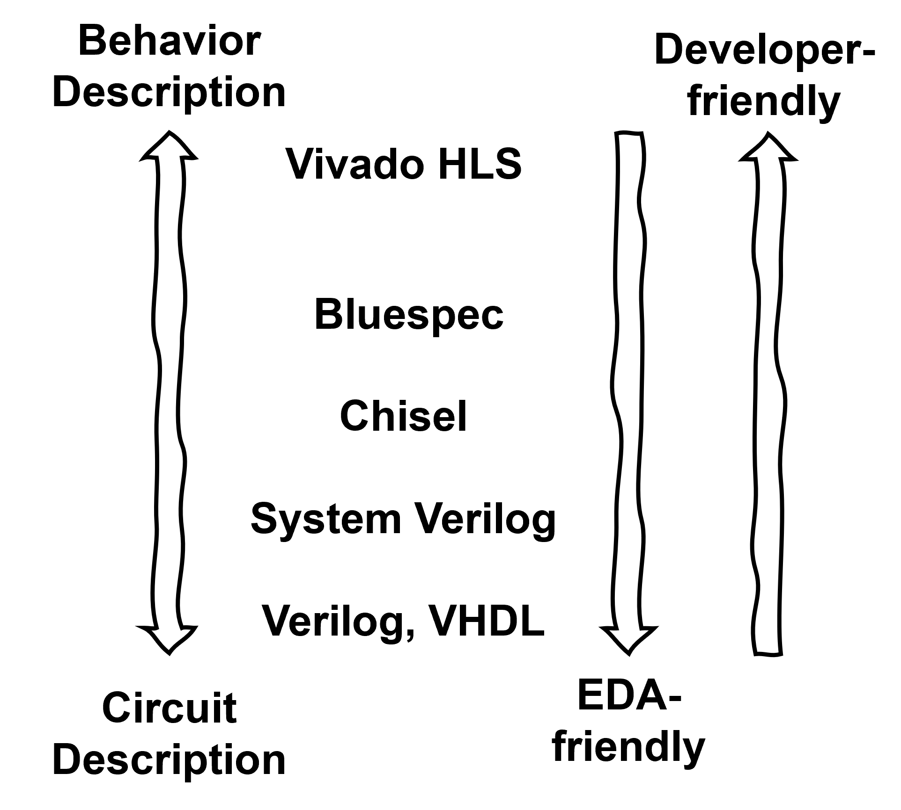
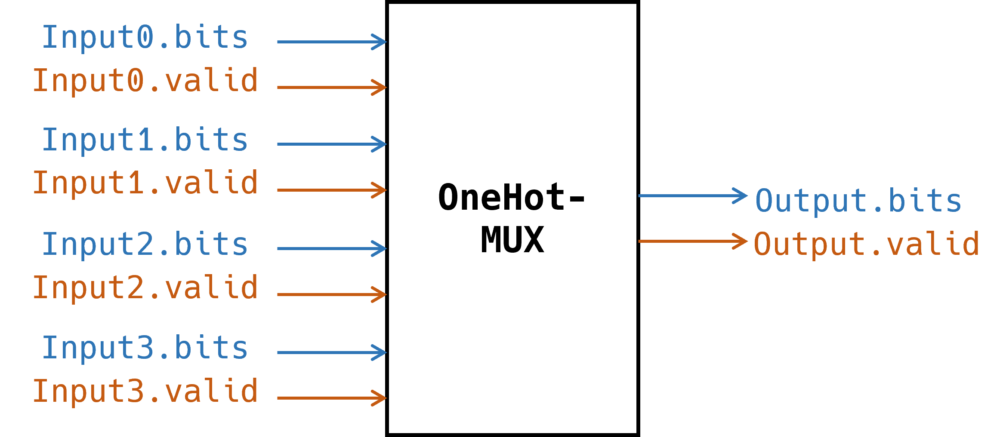
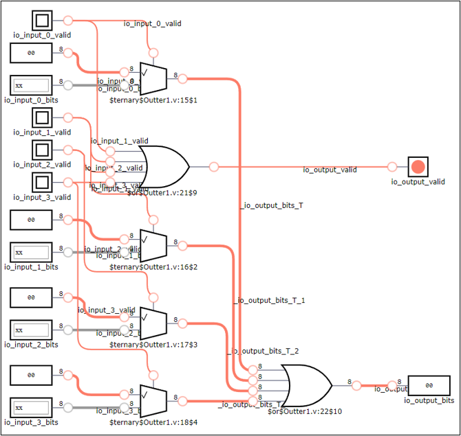
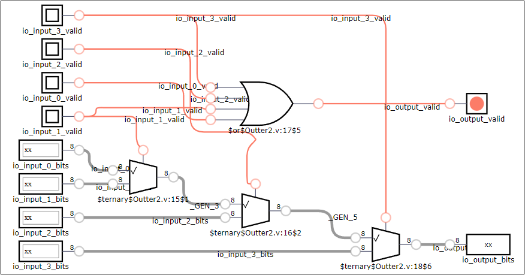

*This article is derived from a tutorial I conducted for new students in our research group. While the primary goal of that tutorial was to introduce listeners to hardware development and the usage of [Chisel](https://www.chisel-lang.org/), I have extracted some discussions that may also be interesting to people with prior hardware development experience. These include discussions on (a) the disparities between the programming model offered by an HDL and the real-world hardware, and (b) comparisons between various HDLs.*

## The Boundaries of HDLs

In contrast to software development, hardware development involves significantly more complex workflows. Hardware modules, often referred to as "IP", are initially described by designers using hardware description languages (HDLs). These modules then undergo rigorous testing and verification processes. Once verified, designs can be implemented in the form of Application-Specific Integrated Circuits (ASICs) or Field-Programmable Gate Arrays (FPGAs) for practical use. In this article, our primary focus will be on discussing HDLs since my interest lies in programming languages, as they play a pivotal role in the hardware design process.

There are two distinct programming models for HDLs: one is based on Register-Transfer Level (RTL) abstraction, and the other is based on High-Level Synthesis (HLS) techniques.

In RTL abstraction, a hardware module essentially comprises basic components interconnected. These "basic components" encompass the Input/Output (IO) ports of hardware modules, wires, combinational logic elements, registers, and so on. From this standpoint, describing a hardware module is like creating a diagram: we instantiate various components and interconnect them based on different conditions.

HLS techniques allow programmers to describe hardware using general-purpose languages like C/C++. Programmers can simply articulate the behavior of the hardware, and HLS tools subsequently take on the task of synthesizing it into RTL and lower-level representations.

Nevertheless, as programmers, it would be helpful to keep in mind that there always exists a gap between the programming model and real hardware, regardless of how "low-level" an HDL may be. For instance, Verilog, although considered a low-level HDL operating at the RTL level, cannot:

1. Specify the physical placement of components.
2. Determine the specific electronic components that will be used in the resulting implementation. (Considering language-defined logic gates, they can be implemented using transistors or FPGA look-up tables.)

This gap does not imply that these languages lack expressiveness. On the contrary, I believe this gap is intentionally designed to abstract away details at the hardware design stage. In the case of Verilog mentioned earlier, placement and component selection can significantly impact the performance of the resulting circuits. However, these details are platform-specific and are typically managed in subsequent stages of the workflow by EDA tools in practice. Keeping such details separate from the semantics of the HDL enhances the language's conciseness and generality.

## Two Dimensions of Expressiveness

After recognizing the inherent boundaries of HDLs, which manifest as the gap between the programming model and real hardware, it is possible for us to discuss a perspective on evaluating them.

Although it may not be a consensus, I propose that HDLs possess two dimensions of expressiveness: the capacity to articulate **hardware behavior** and the ability to detail **circuit connectivity**. The former dimension represents the viewpoint of human cognition; it pertains to our desire to explicitly describe, at the code level, the behavior of hardware (e.g., its operations, interactions with other hardware modules). The latter dimension embodies the perspective of the physical world: EDA tools require precise information about the circuit description (i.e., RTL description) of your design to carry out synchronization and implementation stages. If the HDL cannot provide enough information on circuit description, then an explicit or implicit translation stage must be introduced into the workflow, often converting the current language into a more EDA-friendly one (e.g., Verilog). The diagram below illustrates these two dimensions of expressiveness and how existing HDLs fit into this spectrum.


{.img-40}

Ideally, we hope an HDL to offer high expressiveness in both of these dimensions. Unfortunately, due to the inherent characteristics of hardware, these two dimensions frequently conflict with each other. Behavior may not be readily discernible from a circuit diagram, adding complexity to hardware development and code maintenance. Conversely, describing hardware behavior alone is inadequate for determining the hardware's actual circuitry, as multiple circuits could fulfill the specified requirements.

Within this spectrum, Chisel occupies an intriguing position. It is an HDL embedded within a functional programming language (Scala). Similar to Verilog, Chisel also operates at the RTL abstraction layer and is not akin to "[HLS](https://en.wikipedia.org/wiki/High-level_synthesis) of Scala." This implies that Chisel excels in describing circuits. Furthermore, one can easily envisage Chisel developers harnessing the abstraction and user-friendliness afforded by Scala to enhance the flexibility and extensibility of their designs. These advantages make Chisel an appealing choice for people new to hardware development (myself included).

## Is Chisel a Good Choice?

These days, we often hear complaints about software gobbling up more memory and executables growing larger. This is mainly a result of efforts to reduce development complexity. Programming languages with powerful abstraction capabilities and frameworks geared towards agile development are gaining popularity. This trend highlights an interesting phenomenon in the software world: people are willing to trade off a certain level of application efficiency in exchange for easier and faster development.

However, this observation doesn't quite hold in the hardware development realm. Due to the high costs associated with hardware production, people are generally reluctant to sacrifice hardware efficiency for development efficiency. This is why HDLs like Verilog and System Verilog continue to dominate the industry. They offer the expressiveness needed to accurately implement hardware.

So, when experienced hardware developers encounter Chisel, it's natural for them to have doubts. Despite its claims of flexibility, the question remains: does this language really capable of implementing efficient hardware? While there may have been numerous debates on this issue, given that [Chisel has been introduced for over ten years](https://dl.acm.org/doi/10.1145/2228360.2228584), I'd like to share my response to this question: **Yes, Chisel provides enough expressiveness in circuit description for you to create efficient hardware, but it doesn't prevent you from inadvertently designing suboptimal circuits, especially if you lack experience with Chisel.**

Here is an example to explain my point. Say, we want to implement a simple module named `OneHotMUX`, which takes several signal bundles as input. Each bundle contains a `bits` field for data and a bool field named `valid` indicating whether the input signal is valid. The module assumes that at any given time, there is at most one valid input bundle, and the one will be directed to the module's output. The following is a schematic diagram of this module with four inputs.


{.img-60}

Now we present two versions of implementation of this module in Chisel:

```scala
// version 1
class OneHotMux1(width: Int, forks: Int) extends Module {
  val io = IO(new Bundle {
    val input = Vec(forks, Flipped(ValidIO(UInt(width.W))))
    val output = ValidIO(UInt(width.W))
  })
  io.output.bits := Mux1H(io.input.map(_.valid), io.input.map(_.bits))
  io.output.valid := io.input.map(_.valid).reduce(_ | _)
}

// version 2
class OneHotMUX2(width: Int, forks: Int) extends Module {
  val io = IO(new Bundle {
    val input = Vec(forks, Flipped(ValidIO(UInt(width.W))))
    val output = ValidIO(UInt(width.W))
  })
  io.output.valid := false.B
  io.output.bits := DontCare
  for(i <- 0 until forks) {
    when(io.input(i).valid) {
      io.output.valid := true.B
      io.output.bits := io.input(i).bits
    }
  }
}
```

In version 1, we use the helper circuit `Mux1H` provided by the Chisel library, while in version 2, we simply use a for loop to describe the circuit. Though at the code level, the two implementations seem to be equivalent, it turns out that their resulting Verilog modules are quite different. Here we use an [online tool](http://digitaljs.tilk.eu) to visualize the Verilog modules.

This is the resulting module of the first version of implementation:


{.img-80}

There are four parallel multiplexers in the circuit, one for each input, selecting between the input's `bits` field and all zero based on whether the input is valid. Then the outputs of all multiplexers are ORed together to form the output's `bits` field. The `valid` field of output signal is simply the OR combination of `valid` field of all input signals.

And this is the resulting module of the second version:


{.img-80}

The implementation for output's `valid` field is the same as the first one, but this circuit contains three serial multiplexers. 

It's not immediately clear which implementation version is better. The second one may seem to involve fewer gates and possess a longer critical path, but this isn't necessarily the case, as the target platform might offer multi-way multiplexers. **The key point here is that sometimes, the resulting circuit is not directly reflected in Chisel code, leaving opportunities for developers to unintentionally create circuits that deviate from their original intentions.** In my view, this issue shouldn't be seen as a flaw of Chisel. It stems from the inherent ambiguity of language features like higher-order functions and loops, rather than a lack of circuit expressiveness (since it's entirely possible to manually define and connect each gate in Chisel, much like Verilog). This means that with some experience, such issues can be avoided.

