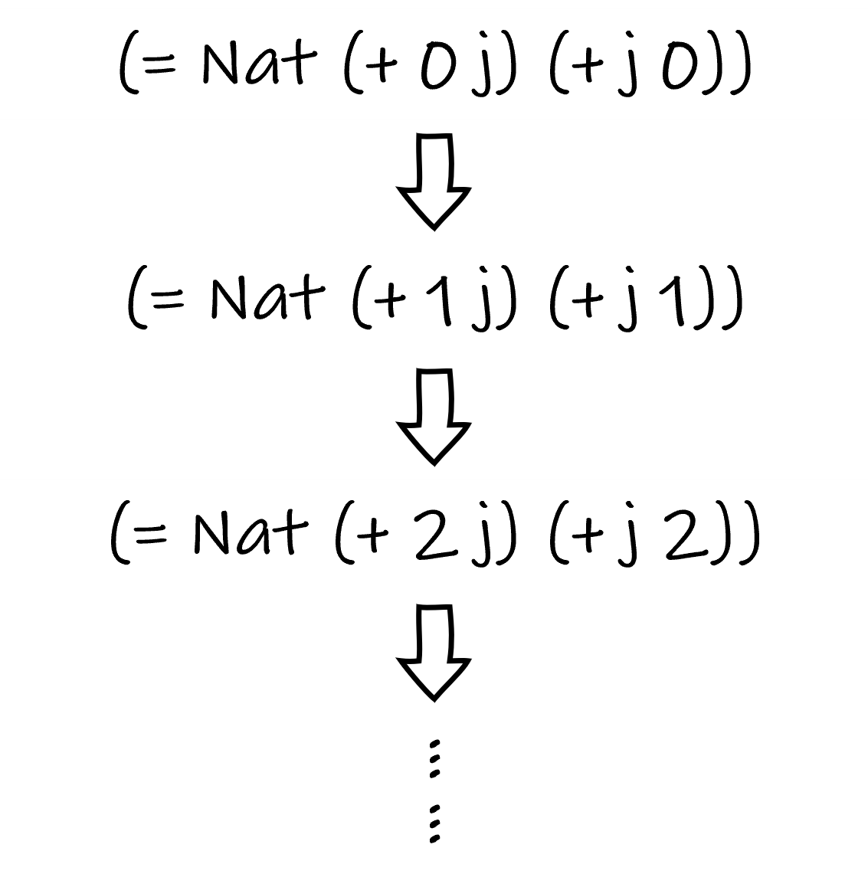
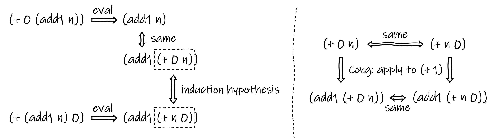
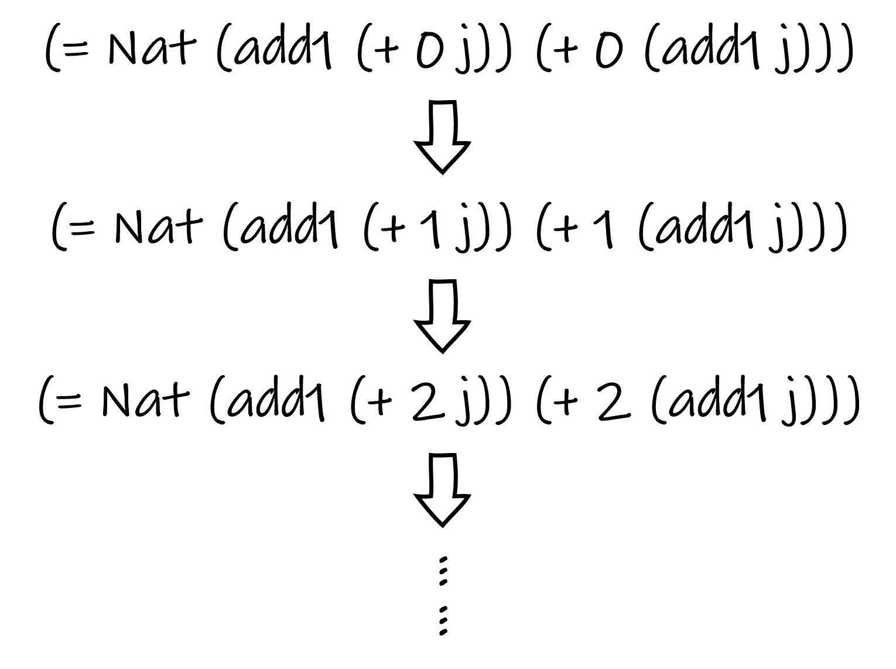
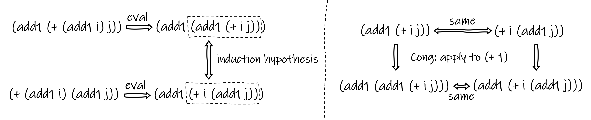
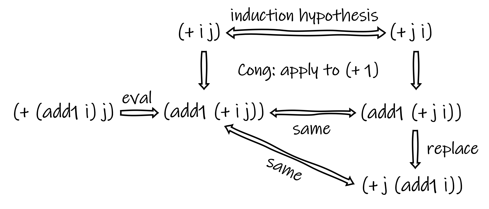

***[The Little Typer](https://thelittletyper.com/)**, written by Daniel P. Friedman and David Thrane Christiansen, provides an accessible introduction to dependent type theory. This article briefly summarizes what I have learned from the book.*

## An Overview of Pie

The authors of the book designed a language named **Pie** to demonstrate their ideas. Basically, Pie has a similar syntax to Scheme - you write code in a pure functional style and play with nested brackets. Every expression in Pie can be described by a *type* (besides `U`, which describes types other than itself). We can use `define` to combine a name to an expression, but before doing so we must `claim` the type of that expression.

```scheme
;; define an Nat
(claim this-is-a-natral-number
  Nat)
(define this-is-a-natral-number
  (add1 (add1 zero)))

;; define a Pair of Nat and Atom (Atoms are just literals)
(claim pair-of-nat-and-atom
  (Pair Nat Atom))
(define pair-of-nat-and-atom
  (cons zero 'something))

;; define a function which takes two Nat and return the second one
(claim second-nat
  (-> Nat Nat
      Nat))
(define second-nat
  (lambda (a b)
    b))
```

In Pie, types are constructed by *type constructors*, and data, which are things that are not types themselves, is constructed by *data constructors*. In above examples, `Nat`, `Pair` and `->` are type constructors, while `add1`, `zero`, `'something` and `lambda` are data constructors. Specifically, `add1` and `zero` construct value that is a `Nat`, `'something` construct value that is a `Atom`, and `lambda` construct value that is a `->` (you can also call it a function).

Besides constructors, there are also *eliminators*, which consume what have been built by constructors, or in other words, extract the information from those specific structures. Two eliminators you might be familiar with are `car` and `cdr`, which extract the first element and the second element from a `Pair`, respectively.

It probably won't surprise you that type constructors can take other types as input. When defining containers like arrays or lists in other programming languages, we usually specifies the type of elements in that container. However, in dependent type theory, type constructors can also take values as input. A simple example in Pie is `Vec`, a type of container that encodes the number of entries in its type.

```scheme
(claim three-apples
  (Vec Atom 3))
(define three-apples
  (vec:: 'apple
     (vec:: 'apple
        (vec:: 'apple vecnil))))
```

Values that exist in type definitions can also be bounded. To express this, we need the `Pi` constructor, which captures the input values and enables us to reference these values in the body of type definitions.

```scheme
;; add-one-apple accept a Vec with n entries, and
;; yields a Vec with (add1 n) entries
(claim add-one-apple
  (Pi ((n Nat))
    (-> (Vec Atom n)
        (Vec Atom (add1 n)))))
(define add-one-apple
  (lambda (n)
    (lambda (some-apple)
      (vec:: 'apple
         some-apple))))
```

It turns out that this feature greatly expands the expressiveness of a type system, offering us much more power than just writing safer containers.

Pie is a small language in the sense that it only supports a predefined set of constructors/eliminators. Although you are allowed to define functions, you are not allowed to define your own types in this language. Additionally, it does not allow arbitrarily recursive functions, as the designers want to ensure functions in this language always terminate and can yield a value for every valid input specified by their type. You can, however, use some predefined eliminators to achieve limited recursion through structures like `Nat` or `List`.

A frequently used example of such an eliminator is `ind-Nat`, which follows the typing law below:

> ```
> If target is a Nat, mot is an
>   (-> Nat
>     U),
> base is a (mot zero), and step is a
>   (Pi ((n-1 Nat))
>     (-> (mot n-1)
>       (mot (add1 n-1)))),
> then
>   (ind-Nat target
>     mot
>     base
>     step)
> is a (mot target).
> ```

The evaluation commandment of `ind-Nat` is:

>```
>An
>  (ind-Nat zero
>    mot
>    base
>    step)
>evals to
>  base.
>An
>  (ind-Nat (add1 n)
>    mot
>    base
>    step)
>evals to
>  (step n
>    (ind-Nat n
>      mot
>      base
>      step)).
>```

In general, `ind-Nat` decreases the size of the `Nat` *target* during each call to *step*. When it reaches the bottom, where *target* is `zero`, a *base* value is yielded. The function *mot* (i.e. "motive") is used to generate a type for each `ind-Nat` expression based on its *target*'s size. Note that this is another showcase of dependent types: the type of an `ind-Nat` depends on its *mot* and *target*.

There is another eliminator called `iter-Nat`, which is like a simplified version of `ind-Nat`. It differs from `ind-Nat` in that it does not have a *mot*, and thus its type is not dependent on the *target*. The whole `iter-Nat` expression always has the same type as its *base*. We can use `iter-Nat` to define `+` for natural numbers.

```scheme
(claim +
  (-> Nat Nat
      Nat))
(define +
  (lambda (a b)
    (iter-Nat a
      b
      (lambda (n)
        (add1 n)))))
```

The meaning and usage of `ind-Nat` might seem ambiguous for now, but its purpose will become clearer when we start doing proofs with it.

## Propositions as Types

Types, in dependent type theory, can be seen as propositions (or statements) in logic. To prove a proposition claimed in a type, all we have to do is finding an expression of that type. However, not all types would make meaningful propositions. For example, any number can be a "proof" of the type `Nat`, which is not very insightful. To build reasonable propositions, we need some carefully designed type constructors.

In Pie we have the type constructor `=`, which is used to express the idea of equality between expressions. The typing law of `=` is:

> ```
> An expression
>   (= X from to)
> is a type if X is a type, from is an X, and to is an X.
> ```

Obviously, `=` is also a dependent type that depends on values. The only data constructor for the `=` type is `same`. The typing law of `same` is:

> ```
> The expression (same e)
> is an
>   (= X e e)
> if e is an X.
> ```

Now we can express ideas such as "(2 plus 2) equals (1 plus 3)" using the type `(= Nat (+ 2 2) (+ 1 3))`. The proof of this statement is the value `(same 4)`. Note that the type checking process respects evaluation. In other words, `(+ 2 2)` and `(+ 1 3)` would be regarded as "the same" 4, because both can be evaluated to 4.

In this aspect, `->`, the type constructor for functions, could be read as "implies". The function type `(-> A B)` has the meaning of "A implies B" in logic, which makes sense because this function generates something of type B (and thus its corresponding proposition) from a given input of type A. Moreover, the type constructor `Pi` stands for "for all". The function type `(Pi ((n Nat)) A)` means "for all natural numbers n, A holds".

In addition to propositions, we also need rules for deduction. Two eliminators for `=` that can be helpful are `cong` (congruence) and `replace`.

The typing law of `cong` is as follows:

>```
>If f is an 
>  (-> x
>    Y)
>and target is an (= X from to),
>then (cong target f) is an (= Y (f from) (f to)).
>```

The evaluation commandment of `cong` is:

> ```
> An (cong (same x) f)
> evals to
>   (same (f x)).
> ```

Basically, `cong` expresses that if we know two expressions are equal, then applying them to a valid function will yield results that are also equal to each other.

The eliminator `replace` is more flexible, indicating that two equal expressions are interchangeable in any statements that involve them. It follows the typing law:

> ```
> If target is an
>   (= X from to),
> mot is an
>   (-> X U),
> and base is a
>   (mot from),
> then 
>   (replace target
>     mot
>     base)
> is a 
>   (mot to).
> ```

Recall what we learned in math class about mathematical induction. To prove a property holds for all natural numbers, we first examine if the property is true for zero. Then, we assume that the property holds for a natural number n, and we prove that the property would still hold for the successor of n (i.e. n+1). By doing so, we show that the property holds for zero and all of its successors, and thus holds for all natural numbers.

In Pie, `ind-Nat` can do the same thing for us. The *base* serves as the evidence for the base case. The *mot* generates a type/proposition based on a given `Nat`. The function *step*, which takes in a `(mot n)` and yields a `(mot (add1 n))`, is just the induction step, where we make an assumption on number n and prove the property for number n+1.

## Example: Proving the Commutative Property of `+`

It's now time for us to put the tools we've learned to use. In this example, we will try to prove the commutative property for the addition `+` function we defined previously. In other words, we want to prove that:

```scheme
(claim +-cmt
  (Pi ((i Nat) (j Nat))
    (= Nat (+ i j)
           (+ j i))))
```

A natural idea is to leave `j` fixed and apply induction on `i`, as the following figure helps illustrate.


{.img-40}

Let's first examine the base case. Are `(+ 0 j)` and `(+ j 0)` the same `Nat`? The evaluation commandment of `iter-Nat` indicates that whether an `iter-Nat` expression can be further evaluated depends on the *target*. For `+`, the target is its first argument. In `(+ 0 j)`, the first argument is `0` so it evaluates to `j`. However, `(+ j 0)` cannot be further evaluated since `j` is a bound variable and its value is unknown until it is applied. It seems the base case is not immediately obvious - we must first prove that `(= Nat (+ 0 j) (+ j 0))`.

We claim this as a proposition:

```scheme
(claim 0+n=n+0
  (Pi ((n Nat))
    (= Nat (+ 0 n) (+ n 0))))
```

The equality `0+n=n+0` can be proved by induction on `n`. The induction process is illustrated below.


{.img-40}


This time, the base case is self-evident: `(+ 0 0)` and `(+ 0 0)` are of course the same `Nat` zero. For the induction step: Given the induction hypothesis `(= Nat (+ 0 n) (+ n 0))`, we must prove that `(= Nat (+ 0 (add1 n)) (+ (add1 n) 0))`. Let's observe the structure of `(+ 0 (add1 n))` and `(+ (add1 n) 0)`. With respect to evaluation, the former one is equal to `(add1 (+ 0 n))`, while the latter is equal to `(add1 (+ n 0))`. According to the induction hypothesis, these are two equal expressions wrapped by an `add1`, so they should still be equal to each other. This can be expressed using `cong`. The induction step is shown in the diagram below.




The proof of `0+n=n+0` could be written as:

```scheme
(define 0+n=n+0
  (lambda (n)
    (ind-Nat n
      (lambda (n-1)
        (= Nat (+ 0 n-1) (+ n-1 0)))
      (same zero)
      (lambda (n-1 assume)
        (cong assume (+ 1))))))
```

Now we have proved the base case of `+-cmt`. The next step is to prove the induction step, which is: Given the induction hypothesis `(= Nat (+ i j) (+ j i))`, we must prove that `(= Nat (+ (add1 i) j) (+ j (add1 i)))`. Note that `(+ (add1 i) j)` can be evaluated to `(add1 (+ i j))`, while `(+ j (add1 i))` cannot be further evaluated. This raises an issue: are `(add1 (+ i j))` and `(+ j (add1 i))` the same `Nat`? Based on intuition, they are equal as natural numbers, although not in respect of evaluation. Therefore, an additional proof is required:

```scheme
(claim add1+=+add1
  (Pi ((i Nat) (j Nat))
    (= Nat (add1 (+ i j))
           (+ i (add1 j)))))
```

The same proof technique will be adopted. We fix `j` and induct on `i`, as the following figure shows.


{.img-40}

Again, we find that the base case of `add1+=+add` is straightforward, as both `(add1 (+ 0 j))` and `(+ 0 (add1 j))` evaluate to the same expression `(add1 j)`. The induction step proceeds similarly to the proof of `0+n=n+0`. You can refer to the following figure for an illustration of this induction step.




Below is a proof of `add1+=+add1`:

```scheme
(claim mot-add1+=+add1
  (-> Nat Nat
      U))
(define mot-add1+=+add1
  (lambda (j i)
    (= Nat (add1 (+ i j))
           (+ i (add1 j)))))

(claim step-add1+=+add1
  (Pi ((j Nat) (i Nat))
    (-> (mot-add1+=+add1 j i)
        (mot-add1+=+add1 j (add1 i)))))
(define step-add1+=+add1
  (lambda (j i)
    (lambda (assume)
      (cong assume (+ 1)))))

(define add1+=+add1
  (lambda (i j)
    (ind-Nat i
      (mot-add1+=+add1 j)
      (same (add1 j))
      (step-add1+=+add1 j))))
```

We can now return to proving `+-cmt`. According to the induction hypothesis, `(= Nat (+ i j) (+ j i))`. Using `cong` we obtain `(= Nat (add1 (+ i j)) (add1 (+ j i)))`. Since we already proved that `add1+=+add1`, we can replace `(add1 (+ j i))` with `(+ j (add1 i))` to yield `(= Nat (add1 (+ i j)) (+ j (add1 i)))`. Because `(add1 (+ i j))` is the same `Nat` as `(+ (add1 i) j)` in respect of evaluation, we reach the desired result for induction step: `(= Nat (+ (add1 i) j) (+ j (add1 i)))`. The following diagram illustrates these steps.


{.img-80}


Finally, we can complete the remaining code.

```scheme
(claim mot-+-cmt
  (-> Nat Nat
      U))
(define mot-+-cmt
  (lambda (j i)
    (= Nat (+ i j)
           (+ j i))))

(claim mot-step-+-cmt
  (-> Nat Nat Nat
      U))
(define mot-step-+-cmt
  (lambda (j i)
    (lambda (n)
      (= Nat (add1 (+ i j)) n))))

(claim step-+-cmt
  (Pi ((j Nat) (i Nat))
    (-> (mot-+-cmt j i)
        (mot-+-cmt j (add1 i)))))
(define step-+-cmt
  (lambda (j i)
    (lambda (assume)
      (replace (add1+=+add1 j i)
        (mot-step-+-cmt j i)
        (cong assume (+ 1))))))

(define +-cmt
  (lambda (i j)
    (ind-Nat i
      (mot-+-cmt j)
      (0+n=n+0 j)
      (step-+-cmt j))))
```

We have completed our proof. This article aims to give you an introductory understanding of reasoning and proof techniques in dependent type theory. I hope you enjoy it as much as I do!

## Recommend Reading

1. Daniel P. Friedman and David Thrane Christiansen. *The Little Typer.*

*All the code in this article has been verified with the interpreter developed by the authors of The Little Typer. Pie is integrated in [Racket](https://racket-lang.org/) IDE, you can install it via Racket's package manager.*

