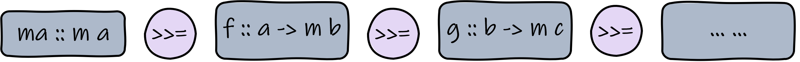
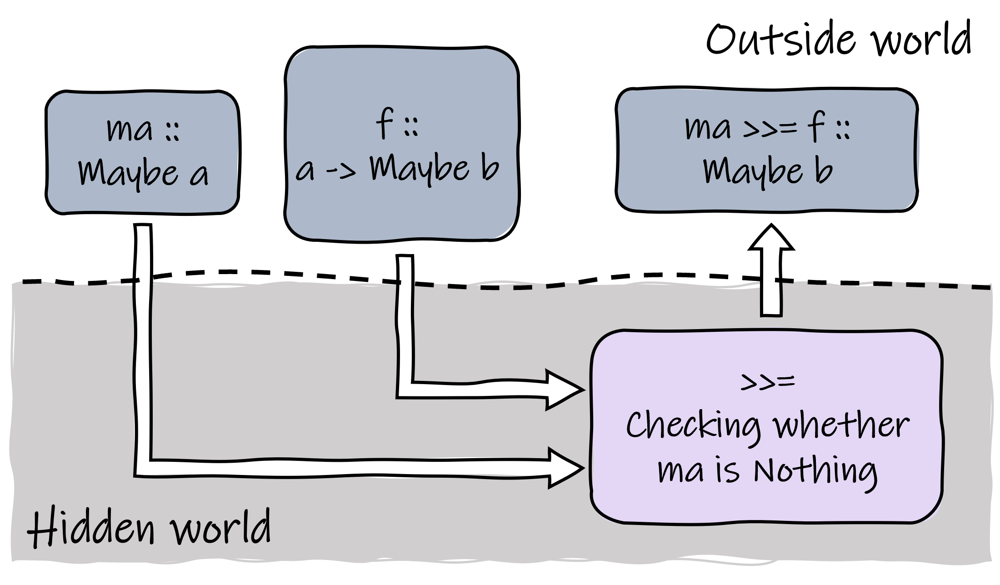
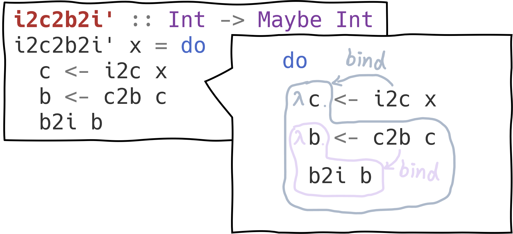
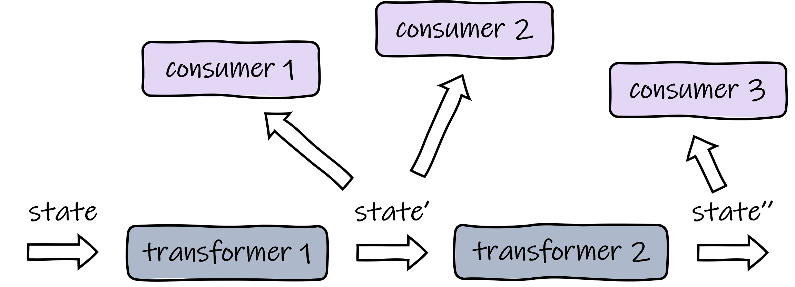
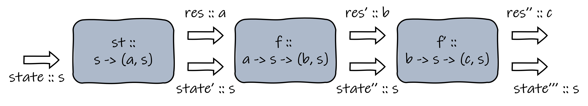
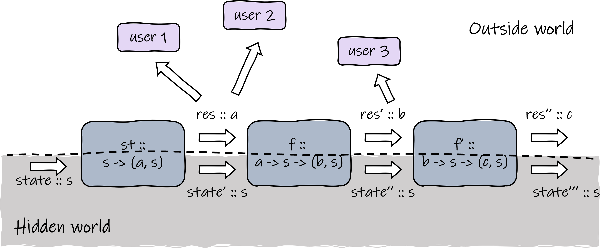
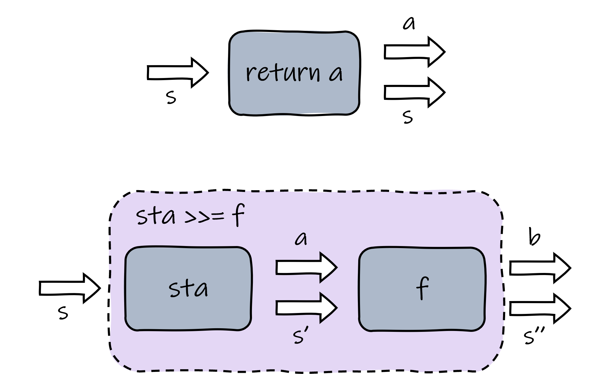
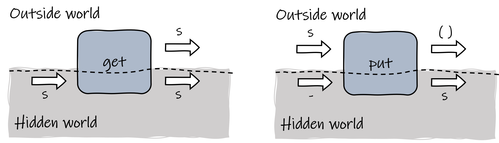
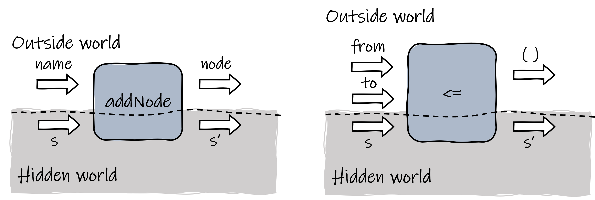
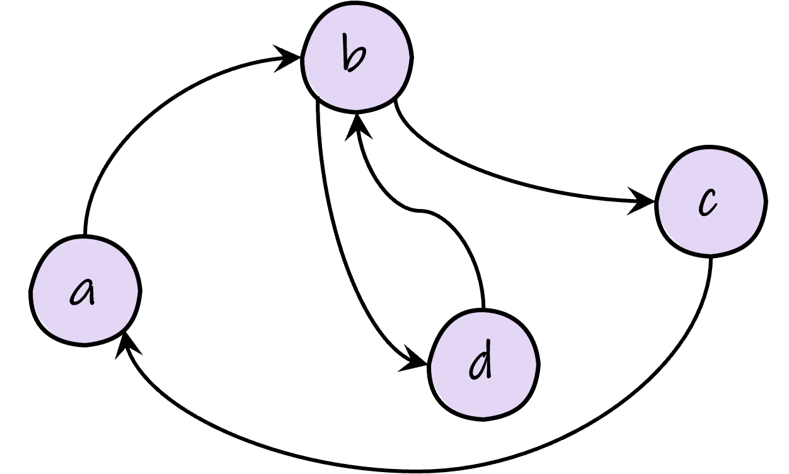

*While there are already numerous tutorials explaining what a **Monad** is on the internet, I will strive to present it in a more intuitive and friendly manner. Additionally, we will walk through an example of utilizing the state monad to develop a small embedded DSL in Haskell.*

## Hiding Things Introduces Impurity

To understand monads, we must first discuss their motivation. A significant advantage of functional programming (FP) languages is that functions are free of *side-effects*, making programs easier to construct and reason about. You may also hear that functions are *pure* in FP, or that FP is stateless. These statements are strongly connected and have a causal relationship.

We say a function has side-effects if executing it changes the world outside the function's scope, whether through an IO operation or modification of a value. FP languages typically enforce immutable data structures, eliminating the side-effects of functions.

On the other hand, the purity of functions requires that they always produce the same output when given the same input. This is a weaker condition than the former (i.e., side-effects freedom), because the only way to make a function *impure* is to enable it to access modifiable external values. If everything is passed explicitly as an argument to functions, then no impurity or side-effects can survive. Impurity, as well as observable effects and states, are caused by a lack of explicit information, or in other words, something being hidden from our sight.

What if we want to program with effects in a pure FP language like Haskell? Is it possible to intentionally hide some part behind the scene to create desired effects and impurity? This is the motivation for monads, which help us to program with effects.

## What Makes a Monad a Monad?

Leaving aside category theory, in Haskell, a `Monad` is simply a typeclass. If you're unfamiliar with Haskell, think of it like the generic containers in C++. If you provide a class's comparison function, the container's sorting method can work seamlessly for the contained class. A typeclass is defined by declaring a set of functions, which specifies what we can do with data types belonging to this typeclass. To make a data type an instance of a typeclass, one needs to implement the declared functions.

Only data types of kind `* -> *` can be made into monads. This means the type constructor should receive a concrete data type to become a concrete data type. Examples include the `Maybe` type and the `[]` (list) type.

```haskell
data Maybe a = Nothing | Just a
data [] a = [] | a : [a]
```

Two functions must be implemented when defining an instance of `Monad`.

```haskell
class Monad m where
  (>>=) :: m a -> (a -> m b) -> m b
  return :: a -> m a
```

The `>>=` operator is called the "bind operator." Along with the `return` function, it can be used to construct our desired behavior over monads.

Before we examine these functions, recall that I said monads enable us to hide something behind the scenes. So for now, imagine two separate worlds: one is the "outside world," where everything we can observe lives, and the other is a "hidden world," where something is automatically handled by monads.


{.img-60}


The `return` function is straightforward: it takes a concrete type and wraps it into a monad. The bind operator deserves more attention. Let's take a closer look at its type. Since `a` and `b` are just generic types and we know little about what we can do to them, the type of `>>=` indicates that maybe the operator would extract an `a` from the first input of type `m a`, feeding it to the second input, which is a function of type `a -> m b` to produce the resulting `m b` value. The gap between `m a` and `a` is where the magic happens: when conducting the "extraction" process, `>>=` hides things from the user of monads and thus creates observable effects.

Also, notice that the resulting value of type `m b` is ready to be bound with another function. In practice, we will typically use `>>=` to chain a series of functions. You can grasp this concept with the following figure.


{.img-80}

One of the most famous and easy-to-understand monads is the Maybe monad. `Maybe` is a wrapper type used when we want to express that a computation *may* or *may not* produce a result:

```haskell
data Maybe a = Nothing | Just a
```

The motivation for using the Maybe monad is natural: when we are doing a chain of computing, where at each step a value of `Maybe` type is produced, it is tedious to write code checking whether a value is `Nothing` at every function call. Instead, we can let `Maybe` be an instance of `Monad` and let the bind operator help us do this when we are creating a chain of function calls:

```haskell
instance Monad Maybe where
  (>>=) :: Maybe a -> (a -> Maybe b) -> Maybe b
  Just x >>= f = f x
  Nothing >>= _ = Nothing
  
  return :: a -> Maybe a
  return x = Just x
```

With the Maybe monad, we can now do something like this:

```haskell
-- say we have a series of functions that can produce Maybes
i2c :: Int -> Maybe Char
i2c 0 = Just '0'
i2c _ = Nothing

c2b :: Char -> Maybe Bool
c2b '0' = Just True
c2b _ = Nothing

b2i :: Bool -> Maybe Int
b2i True = Just 0
b2i _ = Nothing

-- we can use Monad to chain them without worrying about checking for Nothing
i2c2b2i :: Int -> Maybe Int
i2c2b2i x = i2c x >>= c2b >>= b2i
```

Recall the metaphor of "two separate worlds". We said that monads automatically handle things for us in the hidden world. In the case of the Maybe monad, the hidden part is the routine of checking whether a maybe value is `Nothing`.


{.img-60}

Besides `>>=` and `return`, the `Monad` typeclass also defines the `>>` operator, which has a default implementation and can be used directly:

```haskell
(>>) :: m a -> m b -> m b
ma >> mb = ma >>= \_ -> mb
```

The `>>` operator binds monadic values of type `m a` and `m b`, yielding an `m b`. Notice that its implementation uses the `>>=` operator and basically means to bind a function that will ignore `ma` and constantly produce `mb`. This seems a bit irrelevant for the Maybe monad, but `>>` can be quite useful in other monads, such as the state monad, where we use a series of functions to modify a state and do not care about the result of each function.

Haskell provides a syntax sugar named `do` notation for monads, which enables us to code in an imperative style. The `i2c2b2i` function in the former example can also be defined equivalently with `do` notation:

```haskell
i2c2b2i' :: Int -> Maybe Int
i2c2b2i' x = do
  c <- i2c x
  b <- c2b c
  b2i b
```

The `do` notation block can be directly translated to normal binding that uses `>>=` and `>>`. For `>>` binding, the `do` notation block simply omits the operator. For `>>=` binding, in the `do` notation block, you should first use `<-` to "extract" the wrapped value from a monadic value so that you can further use it. The "extracted" value is essentially the parameter of the following bound function. The figure below helps you understand this.


{.img-60}


## Using a Monad to Program with State 

Haskell, being a stateless FP language, strictly prohibits modifying values. However, in some cases, we do hope to maintain a "state" in our program. To simulate the behavior of modifying a state, we typically use transformer functions that accept a state value and yield a new state value based on the old one. You can imagine there are also consumer functions that are actually making use of these state values.


{.img-60}


We can extend this idea a bit by defining a type of functions named *state transformer*, which takes a state value and produces a new state value along with an optional result of arbitrary type:

```haskell
newtype StateTransform s a = ST (s -> (a, s))

-- helper function to apply the function wrapped by ST
apply :: StateTransform s a -> s -> (a, s)
apply (ST st) s = st s
```

Note that the type constructor `StateTransform` takes two type parameters `s` and `a`. The type `s` represents the type of the state value, and `a` is the type of the optional result. A `StateTransform` is just a function that receives an `s` and produces a pair of `a` and `s`. Sometimes we are also interested in the optional result when we are building state transformers, and we can write functions of type `a -> s -> (b, s)`, which receives a result of type `a` and yields a state transformer. Due to currying, this type can also be interpreted as "receiving an `a` and an `s` to produce a `(b, s)`".

To program with state, we can construct a chain of functions to modify it. The chain can contain both state transformers, in the case that the former optional result is not used, and functions of type `a -> s -> (b, s)`, in the case the former optional result is needed. This might be a little tricky, but you can use the following figure as a reference.


{.img-80}

So far, we still need to pass the state value explicitly, but this is indeed a defect. Think about when you have a small inner function that needs to access a state: you have to pass the state all the way through the calling chain to that small function and return the modified state all the way back to the next user. Most of the other functions' inputs and outputs will get polluted by this, and you definitely want to avoid that. Is it possible to *hide* the routine of state passing behind the scene, enabling users to access the state just like in imperative languages? Specifically, we want state values to flow implicitly between state transformers and only expose the optional result to users.


{.img-80}


Monads can help us with that. Given a specified state type, a state transformer can be made into a monad, and the bind operator does exactly what we need to build the function chain that modifies the state:

```haskell
instance Monad (StateTransform s) where
  return :: a -> StateTransform s a
  return a = ST (\s -> (a, s))

  (>>=) :: StateTransform s a -> (a -> StateTransform s b) -> StateTransform s b
  sta >>= f = ST (\s -> let (a, s') = apply sta s in apply (f a) s')
```

The `return` function of the state monad wraps a value of type `a` into a state transformer, which simply bypasses its input state and puts the wrapped value as the optional result. As for the `>>=` operator, it creates a new state transformer by connecting the outputs of the state transformer `sta` to the inputs of the bound function `f`. The following figure shows what `return` and `>>=` do.


{.img-60}


Since state passing has been hidden by the monad, from the outside world, we need some ways to inspect and control the state. Here we define two helper functions:

```haskell
get :: StateTransform s s
get = ST (\s -> (s, s))

put :: s -> StateTransform s ()
put s = ST (\_ -> ((), s))
```

The `get` function grabs its input state and copies it as its exposed result, so that the outside world knows what the current state is. The `put` function receives a state given by the outside world and injects it as the output state of a state transformer.


{.img-80}


When programming with the state monad, I recommend you think like the figures illustrate: imagine you are constructing a pipeline, each state transformer and bound function is a pipeline stage. You are free to extend the pipeline by adding new stages, and remember the states are always flowing in the hidden world.


## Hands on: A DSL to Draw Graphs

Let's use the state monad to create a small embedded DSL that allows users to define directed graphs in a declarative style. In our example, a `Graph` is simply a list of `Node`s and a list of `Edge`s. Each `Node` contains only a string and an unique id, and each `Edge` records the connection of two nodes:

```haskell
data Node = Node {
  name :: String,
  id :: Int
}

data Edge = Edge {
  from :: Node,
  to :: Node
}

data Graph = Graph {
  nodes :: [Node],
  edges :: [Edge]
}
```

We hope the user can declaratively add nodes and edges to the graph without bothering touching the resulted lists by themselves. To achieve this, we maintain a state to record the current construction of the graph and also a counter that can be used to assign an unique id to each node automatically.

```haskell
data GraphBuilderState = GraphBuilderState {
  nodes_ :: [Node],
  edges_ :: [Edge],
  nodeCount :: Int
}

type GraphBuilder a = StateTransform GraphBuilderState a
```

Now we can provide the building blocks to users: the `addNode` function allows user to add a node to the graph, and to make things cooler, we define the `<=` operator to connect two nodes.

```haskell
addNode :: String -> GraphBuilder Node
addNode name = do
  st <- get
  let node = Node name (nodeCount st)
  put st {
    nodes_ = node : nodes_ st,
    nodeCount = nodeCount st + 1
  }
  return node

infix 5 <=
(<=) :: Node -> Node -> GraphBuilder ()
to <= from = do
  st <- get
  let edge = Edge from to
  put st {
    edges_ = edge : edges_ st
  }
```

As the figure below shows, `addNode` only requires the user to offer the name of the node. It then assigns a fresh id to the new node based on the current state, adding the new node to the list and increasing the counter. It also returns the node to the outside world so that it can be referenced for further use. The `<=` operator simply adds a new edge to the state.


{.img-80}


Finally, assuming we have constructed a "pipeline", which is indeed a big `GraphBuilder ()`, we need to apply an initial state to this pipeline so that the pipeline can throw a final state to us. We can then use the final state to create our graph.

```haskell
buildGraph :: GraphBuilder () -> Graph
buildGraph builder = 
  let st = snd $ apply builder (GraphBuilderState [] [] 0) in
    Graph (reverse $ nodes_ st) (reverse $ edges_ st)
```

That's all for this DSL. We can now use to to define graphs. Here is an example.


{.img-40}

Let's draw it in our DSL:

```haskell
exampleGraphBuilder :: GraphBuilder ()
exampleGraphBuilder = do
  a <- addNode "a"
  b <- addNode "b"
  c <- addNode "c"
  d <- addNode "d"
  b <= a
  c <= b
  d <= b
  b <= d
  a <= c

exampleGraph :: Graph
exampleGraph = buildGraph exampleGraphBuilder
```

That's it! Everything is nice and clean. We will stop here but you can further extend this DSL if you want. For example to enable a bigger graph to be built based on sub-graphs :)

## Recommended Reading/Watching

1. Bryan O'Sullivan, Don Stewart, and John Goerzen. *Real World Haskell.*
2. Graham Hutton. *[AFP 9 - Monads III: State Revisited](https://www.youtube.com/watch?v=WYysg5Nf7AU&list=LL&index=5&t=1070s).*

*The definition of `Monad` I used in this article is in fact an older one. In more recent versions of Haskell, a `Monad` should first be an `Applicative` and a `Functor`. I omitted this part to control the length of the article, but it will not affect the basic understanding of Monads.*  
