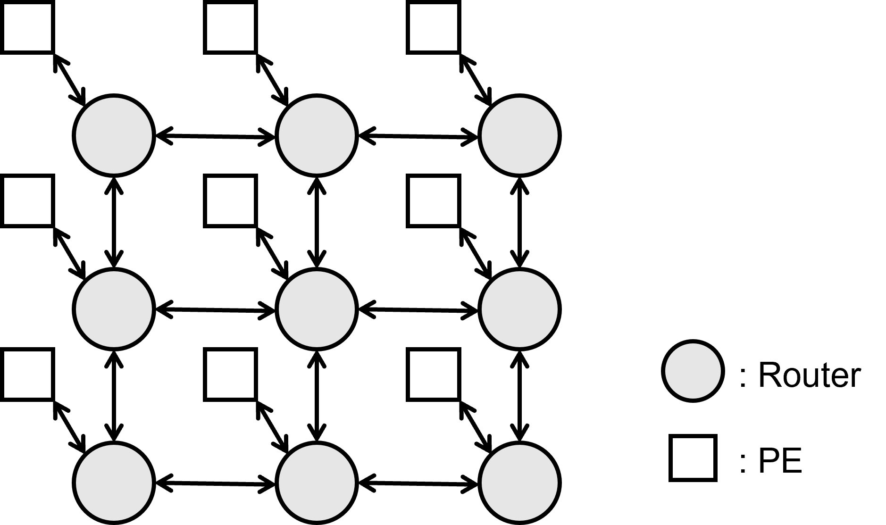
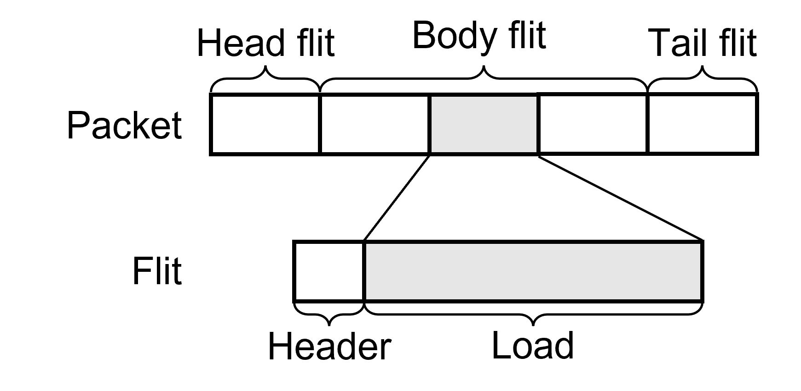
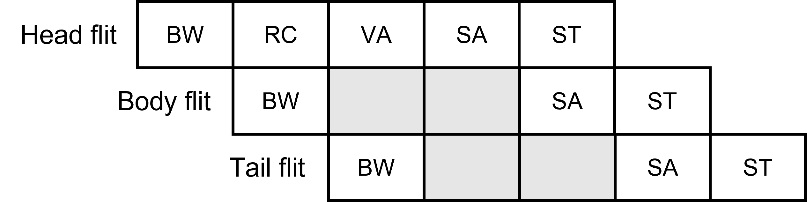
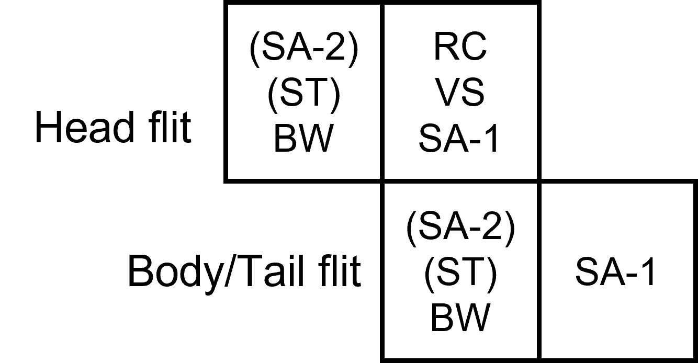
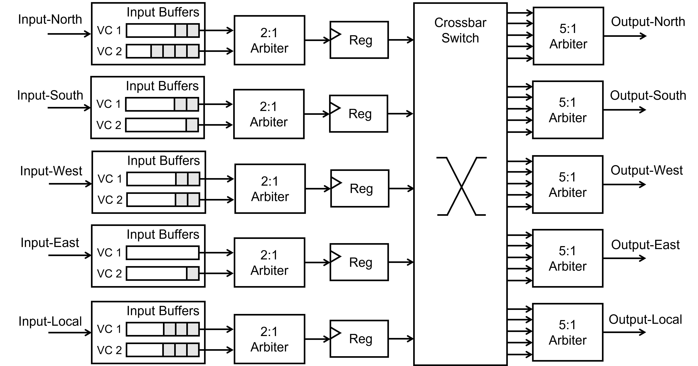
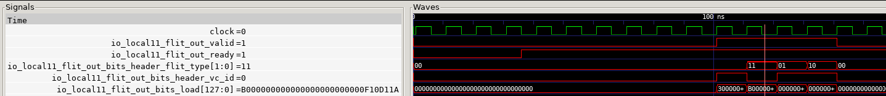

*On-chip networks have become the dominant interconnect technique for modern multi-core architectures due to their good scalability. Router design involves various implementation details, many of which have been extensively studied over the past two decades. In this article, we will implement a router from scratch to demonstrate some key concepts in on-chip network design and make design choices informed by existing good practices.*

*This design is implemented in [Chisel](https://www.chisel-lang.org/). The full list of code can be founded [here](https://github.com/bathtub-01/noc-router). It's released under the MIT license.*

## On-Chip Network Overview

The scalability of on-chip network comes from two aspect. First, the data transmission of connected elements is pipelined by routers, removing the power-consuming and low-frequency long wires from the architecture. Second, The communication on the on-chip network has the characteristic of locality, allowing parallel communication between multiple points without the competition relationship found in traditional bus structures.

We will focus on on-chip networks with 2-D mesh topology, since it is widely used for its ease of use and flexibility. Below is a diagram for a 3×3 2-D mesh network. 


{.img-60}


In a 2-D mesh network, each router is connected to its four neighbor routers and a local processing element (PE). A PE could be a CPU core, a memory controller, or an custom accelerator in heterogeneous architecture. The router's responsibility, is to direct input messages to correct output ports based on their encoded target. A message is generated by a PE, injected to the network through the PE's local router, and travel through the network before reaching the target PE. 

There are some key features of the router we are going to implement (don't worry if there are any unfamiliar terminologies, we will explain them latter):

1. Flit-based wormhole flow control with configurable virtual channels
2. Using credit-based traffic throttling
3. Routing with simple X-first schemes
4. 2-stage pipelining, removing virtual channel allocation with virtual channel selection

## Flow Control, Routing and Pipelining

Here we will briefly explain some key concepts of the router and our design choices.

Just like in computer networks, data delivered through on-chip networks is usually organized as packets by its semantics in the application layer. Generally, as on-chip network designers, we do not make assumptions about the format or length of packets, since they are the payload rather than the control units of our network. We usually focus on the capabilities of the circuit, among which the most significant one is the width of physical links between routers. Packets are segmented into fixed-sized smaller units, which are called "flits" (flow control units), based on the width of links. We generally view the network from the perspective of flits. The following diagram shows how packets are composed of flits.


{.img-40}

Flow control schemes, which determine how network resources (such as links and buffers) are allocated, can be categorized into "packet-based" ones and "flit-based" ones. The term "packet/flit-based" means that network resources are allocated in a per-packet/flit manner. Packet-based flow control schemes such as store-and-forward and virtual-cut-through all require router buffers at each hop to provide full space for an entire packet. Whereas flit-based schemes loosen such constraints, making them more suitable for on-chip design where buffers are usually expensive.

We will adopt a flit-based wormhole flow control scheme in our design. In wormhole flow control, a flit may be forwarded to the downstream router as long as there is enough room for it. The head flit of a packet is responsible for paving the way by providing routing information to the router, and the subsequent flits would simply follow the same route in order. Since flit-based flow control does not require full space for the entire packet at each router, a blocked packet might occupy a chain of routers, which might heavily decrease the utilization rate of physical links. To alleviate this problem, we can apply time-division multiplexing to allow multiple virtual channels (VCs) to share a single physical link. Each VC corresponds to an independent buffer in the router, and is exclusively occupied by a single packet during its transmission. In this way, a blocked packet will only affect its own VC, instead of the whole physical link.

Routing algorithms determine the route path of packets. In other words, routers need a routing algorithm to decide which port should be taken to send out an incoming flit. Although there exist a lot of research on routing algorithms, especially adaptive ones, we will choose deterministic routing. In deterministic routing, the route path is fixed once we know the source node and destination node of a packet. Deterministic routing is wildly adopted because of its simplicity, which is an important virtue in hardware design (and in practice, it is generally good enough). In our case of 2-D mesh networks, we use X-first routing, which will route the packet to its target row through X-axis and then route the packet to its target column through Y-axis.

The working process of a router typically involves several stages: buffer write (BW), route computation (RC), VC allocation (VA), switch allocation (SA) and switch traversal (ST). In BW stage, a flit is written into the buffer corresponding to the VC it belongs. Then, if the flit is a head flit, the router must (a) perform RC to determine which output port should this packet take, and (b) conduct VA to provide an available downstream VC for this packet. After RC and VA, the head flit "paves" the way for all following flits at this hop. All flits then goes through SA, where they competes for the desire output port with flits from other input direction, and ST, where they get sent to their target output port as soon as win the SA competition. Below is a pipeline diagram for these logical stages.


{.img-60}


Simply applying this 5-stage pipeline in your design looks a little bit inefficient as VA and SA stages are idle for body and tail flits. In addition, too much pipeline stages could introduce higher latency and more register consumption. In our implementation, we adopt several optimization techniques to reduce latency while maintaining an acceptable max frequency for the circuit. First, we replace VA with VC selection (VS). Unlike VA which let multiple flits compete for a VC, VS is implemented by maintaining a queue of free VCs at each output port and grant a free VC to the SA winner if it is a head flit. This optimization removes VA stages, which can be pretty costly when there exist numerous VCs. Second, we adopt separable allocator design to separate the SA stage's arbiter into two pipeline stages. By doing so, we break the longest critical path in our circuit, and thus makes our pipeline more balanced. Last, we partially combine these stages to construct a 2-stage pipeline structure: RC, VS and SA-1 (first part of SA) form a stage, while SA-2, ST and BW (in the downstream router) form the other stage. Following pipeline diagram demonstrates our idea.


{.img-40}


Now we finishes our explanation of concepts. Next we will describe our implementation.

## Implementation

Here is a diagraming illustrating the overall structure of our router with two VC buffers at each input direction. An input flit will be firstly placed in its corresponding VC buffer based on the information recorded in the flit's header. Then, the buffered flit will participate SA-1, competing with flits from other VCs at the 2:1 Arbiter. The winner of SA-1 will forward to the pipeline register, and then participate SA-2, after which it can leave this router through its desire output port as long as it again wins the arbitration. Note that the router maintains a set of control information for each VC to record their desire output port and also the VC they will take in the next router. The head flit is responsible to update these information by RC and VS.



To implement this router, we first define the format of flits.

```scala
object FlitTypes extends ChiselEnum {
  val head = Value
  val body = Value
  val tail = Value
  val single = Value
}

class FlitHeader extends Bundle {
  val flit_type = FlitTypes()
  val vc_id = UInt(log2Ceil(NetworkConfig.virtual_channels).W)
}

abstract class FlitLoad extends Bundle

class Coordinate extends Bundle {
  val x = UInt(log2Ceil(NetworkConfig.columns).W)
  val y = UInt(log2Ceil(NetworkConfig.rows).W)
}

class HeadFlitLoad extends FlitLoad {
  val source = new Coordinate
  val dest = new Coordinate
  val data = Bits((NetworkConfig.flit_load_width - source.getWidth - dest.getWidth).W)
}

class DataFlitLoad extends FlitLoad {
  val data = Bits(NetworkConfig.flit_load_width.W)
}

class Flit extends Bundle {
  val header = new FlitHeader
  val load = Bits(NetworkConfig.flit_load_width.W)
}
```

Each flit contains a `header` for routing control and a `load` which is the exact payload. The `header` contains a `flit_type` filed and a `vc_id` filed. There are four types of flit: `head`, `body`, `tail` and `single`. While other types are obvious from their names, `single` means this is a packet formed by a single flit. The `vc_id` field is used for putting the flit into its own VC buffer at input port. As for the `load`, since different types of flit should have different format of payload and this kind of variety is hard to express in hardware, we need some trick to help us. In the definition of `Flit`, `load` is just a fix-sized Chisel `Bits`. However, we can define different kinds of `FlitLoad`. The PEs, as generator and consumer of flits, can encode/decode different kinds of `FlitLoad` to/from `Bits` using Chisel's `asTypeOf` method, as long as they have the same bit width. This is a nice coding strategy since it provides a clearer view for us programmers while does not introduce any overhead to the resulting circuit (type transforming is resolved at compile time). In our design we only needs two kinds of `FlitLoad`. One is `HeadFlitLoad` for `head` and `single` flits, which contains the address of the source router and the destination router. The other is `DataFlitLoad`, which only contains the data field and is used by `body` and `tail` flits.

Next, we can define the ports of our router. In 2-D mesh networks, a router has ports in five directions, connecting its four neighbor routers and its local PE. Besides input and output flit ports, the `RouterPort` also contains input and output credit. Credit shows how much free space is available in each VC buffer, which helps neighbor routers achieve flow control.

```scala
class RouterPort extends Bundle {
  import NetworkConfig._
  val flit_in = Flipped(Decoupled(new Flit))
  val credit_in = Input(Vec(virtual_channels, UInt(log2Ceil(buffer_depth + 1).W)))
  val flit_out = Decoupled(new Flit)
  val credit_out = Output(Vec(virtual_channels, UInt(log2Ceil(buffer_depth + 1).W)))
}

class Router(x: Int, y: Int) extends Module {
  val io = IO(new Bundle {
    val north_port = new RouterPort
    val south_port = new RouterPort
    val west_port = new RouterPort
    val east_port = new RouterPort
    val local_port = new RouterPort
  })
  // ...
}
```

It is very easy to implement X-first routing. We simply check whether the flit have reached the target column and row respectively, and send the undelivered flit in the corresponding direction. If we confirm the flit has arrived its target router, we will send it to the local PE.

```scala
object RouteTarget extends ChiselEnum {
  val NORTH = Value
  val SOUTH = Value
  val WEST = Value
  val EAST = Value
  val LOCAL = Value
}

class RouteComputeUnit(x: Int, y: Int) extends Module {
  val io = IO(new Bundle {
    val flit_dest = Input(new Coordinate)
    val route_target = Output(RouteTarget())
  })
  import RouteTarget._
  when(io.flit_dest.x =/= x.U) {
    io.route_target := Mux(io.flit_dest.x > x.U, EAST, WEST)
  }.elsewhen(io.flit_dest.y =/= y.U) {
    io.route_target := Mux(io.flit_dest.y > y.U, NORTH, SOUTH)
  }.otherwise {
    io.route_target := LOCAL
  }
}
```

Next, we will go through some key code in the router module. 
```scala
class Router(x: Int, y: Int) extends Module {
  // ...
  val firstStageLogics = Seq.fill(5)(Module(new FirstStageLogic(x, y)))
  val granters = Seq.fill(5)(Module(new Granter(5)))
  val grantersWires = Wire(Vec(5, chiselTypeOf(granters(0).io)))
  val pipelineReg = Seq.fill(5)(RegInit(0.U.asTypeOf(new FlitAndValid)))
  val vcStates = Seq.fill(5)(RegInit(VecInit.fill(virtual_channels)
                                     (0.U.asTypeOf(new VirtualChannelState))))
  val secondStageFire = WireInit(VecInit.fill(5)(false.B))
  // ...
  // connect first stage logic with pipeline registers
  firstStageLogics.zip(pipelineReg).zip(vcStates).zip(secondStageFire).zip(0 until 5).foreach{case((((fl, r), s), ssf), i) => 
    fl.io.winner_flit.ready := (!r.valid || ssf) &&
                               (!(fl.io.winner_flit.bits.header.flit_type === FlitTypes.head ||
                                  fl.io.winner_flit.bits.header.flit_type === FlitTypes.single) ||
                                grantersWires(fl.io.winner_target.asUInt).granted === i.U)
    when(fl.io.winner_flit.fire) {
      r.flit := fl.io.winner_flit.bits
      r.flit.header.vc_id := s(fl.io.winner_vc).output_vc
      r.valid := true.B
      r.vc := fl.io.winner_vc
    }.otherwise {
      when(ssf) {
        r.valid := false.B
      }
    }
  }
  // ...
}
```

The `FirstStageLogic` is located behind input buffers, containing logics for RC and SA-1. It sends out the winner of the first stage arbiter. We place `pipelineReg` next to `FirstStageLogic` to hold the winner. The key here is to determine at what condition the winner flit can be forwarded to `pipelineReg` and participate the next stage arbitration. We require (a) the pipeline register is empty (i.e., the former winner has already left), and (b) there are only one `head`/`single` flit targeting the same output port can enter the pipeline register at each cycle (this avoids two different packets gain the same VC from free VC queues).

```scala
class Router(x: Int, y: Int) extends Module {
  // ...
  // update VC states when head/single flit arrives
  firstStageLogics.zip(vcStates).zip(pipelineReg).foreach{case((fl, s), r) => 
    fl.io.stall.zip(s).foreach{case(stl, state) =>
      stl := allPortsVec(state.target.asUInt).credit_in(state.output_vc) < 2.U 
    }
    fl.io.free_vc := vcQueuesWires.map(q => q.deq.valid)
    when(fl.io.winner_flit.fire) {
      when(fl.io.winner_flit.bits.header.flit_type === FlitTypes.head ||
           fl.io.winner_flit.bits.header.flit_type === FlitTypes.single) {
        s(fl.io.winner_vc).output_vc := vcQueuesWires(fl.io.winner_target.asUInt).deq.bits
        vcQueuesWires(fl.io.winner_target.asUInt).deq.ready := true.B
        s(fl.io.winner_vc).target := fl.io.winner_target
        r.flit.header.vc_id := vcQueuesWires(fl.io.winner_target.asUInt).deq.bits
      }
    }
  }
  // ...
}
```

When `head`/`single` flit wins the SA-1 arbitration, we need to update the control information stored in `vcStates`. We first take a free VC from the free VC queue at the flit's output port, assign it to the flit, and then update the `vcStates`. Moreover, the output port should also be recorded so that the following `body` and `tail` flits can be handled.

```scala
class Router(x: Int, y: Int) extends Module {
  // ...
  val secondStageLogics = Seq.fill(5)(Module(new SecondStageLogic))
  // ...
  // connect second stage logics with pipeline registers
  secondStageLogics.zip(0 until 5).foreach{case(sl, t) => 
    sl.io.in_flits.zip(pipelineReg).zip(vcStates).zip(secondStageFire).foreach{case(((i, r), s), ssf) =>
      i.valid := (s(r.vc).target.asUInt === t.U) && r.valid
      i.bits := r.flit
      when(i.fire) {
        ssf := true.B
      }
    }
  }
  // ...
}
```

The `SecondStageLogic`, which follows the pipeline registers, contains the logic for `SA-2`. When connecting `SecondStageLogic` to pipeline registers, we should ensure that flits only only participate in arbitration at their output port. We do this by checking the `vcStates` we just updated.

That's it. We have generally covered the implementation of our router. To check the full list of code, go to the [GitHub repository](https://github.com/bathtub-01/noc-router) of this project.

## A Bit of Testing

To observe whether our router can correctly transfer packets, we generate a small 2×2 network for testing.

```scala
class NetworkExample extends Module {
  import NetworkConfig._
  val io = IO(new Bundle{
    val local00 = new RouterPort
    val local01 = new RouterPort
    val local10 = new RouterPort
    val local11 = new RouterPort
  })

  val router00 = Module(new Router(0, 0))
  val router01 = Module(new Router(0, 1))
  val router10 = Module(new Router(1, 0))
  val router11 = Module(new Router(1, 1))

  def routerConnectNull(r: Router) = {
    r.io.north_port <> 0.U.asTypeOf(new RouterPort)
    r.io.south_port <> 0.U.asTypeOf(new RouterPort)
    r.io.west_port <> 0.U.asTypeOf(new RouterPort)
    r.io.east_port <> 0.U.asTypeOf(new RouterPort)
  }
  def routerConnectRow(left: Router, right: Router) = {
    left.io.east_port.flit_in <> right.io.west_port.flit_out
    left.io.east_port.credit_in := right.io.west_port.credit_out
    right.io.west_port.flit_in <> left.io.east_port.flit_out
    right.io.west_port.credit_in := left.io.east_port.credit_out
  }
  def routerConnectCol(up: Router, down: Router) = {
    up.io.south_port.flit_in <> down.io.north_port.flit_out
    up.io.south_port.credit_in := down.io.north_port.credit_out
    down.io.north_port.flit_in <> up.io.south_port.flit_out
    down.io.north_port.credit_in := up.io.south_port.credit_out
  }

  routerConnectNull(router00)
  routerConnectNull(router01)
  routerConnectNull(router10)
  routerConnectNull(router11)

  routerConnectRow(router00, router10)
  routerConnectRow(router01, router11)
  routerConnectCol(router01, router00)
  routerConnectCol(router11, router10)

  io.local00 <> router00.io.local_port
  io.local01 <> router01.io.local_port
  io.local10 <> router10.io.local_port
  io.local11 <> router11.io.local_port
}
```

This network example instantiates four routers and connects them in a 2-D mesh topology. The local port of each router is exposed, so that outside modules can inject and extract flits into and from the network.

We further use a top module to wrap this network. The top module is a state machine, which can inject flits cycle by cycle. In this example, there are two packets being sent. One is a packet formed by three flits, going from (0,0) to (1,1). The other is a single flit packet, going from (1,0) to (1,1).

```scala
class NetworkExampleTop extends Module {
  import NetworkConfig._
  val io = IO(new Bundle{
    val start = Input(Bool())
    val local00_flit_out = Decoupled(new Flit)
    val local01_flit_out = Decoupled(new Flit)
    val local10_flit_out = Decoupled(new Flit)
    val local11_flit_out = Decoupled(new Flit)
  })
  
  object state extends ChiselEnum {
    val idle = Value
    val feed1 = Value
    val feed2 = Value
    val feed3 = Value
    val ending = Value
  }
  import state._
  val network = Module(new NetworkExample)
  val STM = RegInit(idle)

  network.io.local00 <> 0.U.asTypeOf(new RouterPort)
  network.io.local01 <> 0.U.asTypeOf(new RouterPort)
  network.io.local10 <> 0.U.asTypeOf(new RouterPort)
  network.io.local11 <> 0.U.asTypeOf(new RouterPort)

  io.local00_flit_out <> network.io.local00.flit_out
  io.local01_flit_out <> network.io.local01.flit_out
  io.local10_flit_out <> network.io.local10.flit_out
  io.local11_flit_out <> network.io.local11.flit_out

  network.io.local11.credit_in(0) := 8.U
  network.io.local11.credit_in(1) := 8.U

  switch(STM) {
    is(idle) {
      when(io.start) {
        STM := feed1
      }
    }
    is(feed1) {
      network.io.local00.flit_in.valid := true.B
      network.io.local00.flit_in.bits.header.flit_type := FlitTypes.head
      network.io.local00.flit_in.bits.header.vc_id := 1.U
      val load1 = Wire(new HeadFlitLoad)
      load1.source.x := 0.U
      load1.source.y := 0.U
      load1.dest.x := 1.U
      load1.dest.y := 1.U
      load1.data := BigInt("F00D11A", 16).U
      network.io.local00.flit_in.bits.load := load1.asTypeOf(UInt(flit_load_width.W))

      STM := feed2
    }
    is(feed2) {
      network.io.local00.flit_in.valid := true.B
      network.io.local00.flit_in.bits.header.flit_type := FlitTypes.body
      network.io.local00.flit_in.bits.header.vc_id := 1.U
      val load1 = Wire(new DataFlitLoad)
      load1.data := BigInt("F00D11B", 16).U
      network.io.local00.flit_in.bits.load := load1.asTypeOf(UInt(flit_load_width.W))
     
      STM := feed3
    }
    is(feed3) {
      network.io.local00.flit_in.valid := true.B
      network.io.local00.flit_in.bits.header.flit_type := FlitTypes.tail
      network.io.local00.flit_in.bits.header.vc_id := 1.U
      val load1 = Wire(new DataFlitLoad)
      load1.data := BigInt("F00D11C", 16).U
      network.io.local00.flit_in.bits.load := load1.asTypeOf(UInt(flit_load_width.W))

      network.io.local10.flit_in.valid := true.B
      network.io.local10.flit_in.bits.header.flit_type := FlitTypes.single
      network.io.local10.flit_in.bits.header.vc_id := 1.U
      val load2 = Wire(new HeadFlitLoad)
      load2.source.x := 1.U
      load2.source.y := 0.U
      load2.dest.x := 1.U
      load2.dest.y := 1.U
      load2.data := BigInt("F10D11A", 16).U
      network.io.local10.flit_in.bits.load := load2.asTypeOf(UInt(flit_load_width.W))

      STM := ending
    }
    is(ending) {/* nothing to do */}
  }
}
```

In the Chisel tester, we simply kick start this state machine, and step for several cycles. We can then check the resulting waveform, to see if our network behaves as we expected.



As the waveform shows, the two packets have correctly reached the (1,1) router. Note that these two packets reached with different `vc_id`, which distinguishes them from one another. It is worth mention that Chisel's testing framework is powerful enough for you to implement a full featured network simulator with it, if you need to collect more detailed statistics such as latency of packets and congestion rate.

Another aspect, as people may be interested in, is the circuit area and timing of our design. I evaluate this router in Xilinx Vivado, an FPGA EDA tool. Evaluation result shows that on a 7-eg FPGA device, this router can gain a max frequency over 200MHz with hardware consumption summarized in the following table. This result is, good enough, I would say :)

| Resource       | Utilization | Available | Utilization % |
| -------------- | ----------- | --------- | ------------- |
| Loop-up tables | 2594        | 298560    | 0.87          |
| Registers      | 890         | 597120    | 0.15          |

## Recommend Reading

Much of the knowledge in this article comes from:

1. Natalie Enright Jerger, Tushar Krishna and Li-Shiuan Peh. *On-Chip Networks, Second Edition.*
